# 🕌 Muslim Companion - Prayer Times, Quran & Azkar

**Muslim Companion** is a comprehensive Islamic application designed to be a daily assistant for Muslims worldwide. It combines accurate prayer times, Qibla direction, the Holy Quran, daily Azkar, and a massive library of Islamic knowledge in a modern, user-friendly interface that supports both Light and Dark modes.

## 🚀 What's New (Version 1.1.0)
* **📚 Massive Islamic Library:** Added a comprehensive encyclopedia featuring detailed stories of **100 Sahaba & Sahabiyat** (Companions of the Prophet).
* **🎙️ Friday Sermons & Lessons:** Introduced a new section containing **100 structured Islamic lessons and sermons**, ready for reading and sharing.
* **💡 Daily Inspiration Dashboard:** A newly designed home screen featuring a daily Ayah, Hadith, and Dua with a seamless copy-to-clipboard feature for easy sharing.
* **✨ Enhanced UI/UX:** Completely redesigned the Main Menu using `NestedScrollView` for fluid, full-page scrolling, modern ripple effects, and custom transparent dialogs for comfortable reading.

## ✨ Core Features

* **📍 Accurate Prayer Times:**
    * Precise calculations based on user location (GPS or Manual City Selection).
    * Supports multiple calculation methods (Egyptian General Authority, Umm Al-Qura, MWL, etc.).
    * Adjustable Asr calculation (Shafi/Hanbali/Maliki vs Hanafi).

* **📢 Adhan Notifications:**
    * Customizable notifications for each prayer.
    * Beautiful Adhan sounds from Mecca, Medina, and Cairo (Sheikh Abdul Basit).
    * Ability to enable/disable specific prayer alerts.

* **🕋 Smart Qibla Compass:**
    * Real-time Qibla direction using device sensors (Accelerometer & Magnetometer).
    * **Smooth Animation** with Low-Pass Filter for stability.
    * Haptic feedback (Vibration) and visual indication when aligned with the Qibla.

* **📖 Holy Quran & Tafseer:**
    * Read Surahs with clear Uthmanic font.
    * Rich text formatting with Tajweed-friendly rendering.
    * Integrated Tafseer (Interpretation) mode.

* **📿 Daily Azkar & Tasbeeh:**
    * Morning, Evening, and Post-Prayer Azkar.
    * Smart Tasbeeh counter and organized categories.

* **📅 Hijri Calendar:**
    * Display current Hijri and Gregorian dates accurately.

## 🛠 Technologies & Technical Details

This project is built using **Native Android (Kotlin)**, following the **Clean Architecture** principles and **MVVM** pattern to ensure scalability, testability, and maintainability.

### 🏗 Architecture & Design Patterns
* **MVVM (Model-View-ViewModel):** Used to separate the UI (Activity/XML) from the business logic and data operations. The `ViewModel` handles data processing and exposes it via `LiveData`/`StateFlow` to the UI.
* **Repository Pattern:** Acts as a single source of truth, mediating between local data (Database/SharedPrefs) and JSON assets.
* **Singleton Pattern:** Used for database instances (`Room`) to ensure resource efficiency.

### 💻 Core Technologies
* **Kotlin:** The primary programming language, utilizing features like **Null Safety**, **Extension Functions**, and **Data Classes** for concise and robust code.
* **Coroutines & Flow:** Used for handling background tasks (like database queries, scheduling, and loading extensive JSON content) asynchronously without blocking the Main Thread, ensuring a smooth UI experience.
* **Android Architecture Components:**
    * **ViewModel:** To manage UI-related data in a lifecycle-conscious way.
    * **StateFlow/LiveData:** To observe data changes and update the UI reactively.

### 💾 Data & Storage
* **Room Database:** Used to persist user data and cache prayer times locally for offline access.
* **SharedPreferences:** Used to store lightweight user preferences like Selected City, Calculation Method, Madhab, and Dark Mode state.
* **Complex JSON Parsing:** Efficiently parsing massive local JSON assets (`companions.json`, `lessons.json`, `hadith.json`, `QuranDetails.json`) to populate the app's extensive library without overwhelming device memory.

### 📍 Location & Sensors
* **Google Play Services Location (FusedLocationProviderClient):** To fetch the user's precise Latitude and Longitude for accurate prayer time calculation (GPS).
* **Android SensorManager:**
    * **Accelerometer & Magnetometer:** Used to calculate the device's orientation relative to magnetic north.
    * **Low-Pass Filter Algorithm:** Implemented to smooth out sensor data and prevent the compass needle from shaking/jittering.

### ⏰ Scheduling & Notifications
* **AlarmManager:** Used to schedule exact alarms for future prayer times even if the app is killed.
* **BroadcastReceiver:** Acts as the entry point for the alarm to trigger the Adhan notification and play the sound in the background.
* **NotificationChannel:** Created to handle high-priority Adhan alerts with custom sounds.

### 🎨 UI & UX
* **Advanced Layouts:** Implementing `NestedScrollView` containing `ConstraintLayout` and `RecyclerView` (with nested scrolling disabled) for a seamless, stutter-free dashboard experience.
* **Material Design Components:** Used for Cards, Buttons, custom transparent `AlertDialogs`, and Ripple effects (`selectableItemBackground`).
* **Lottie Animations:** Used in the Splash Screen for a high-quality, vector-based loading animation.
* **WebView:** Used to render the Holy Quran text with complex Arabic typography and decorative HTML/CSS styling.
* **ClipboardManager:** Integrated for quick copying and sharing of Hadiths, Ayahs, and daily Duas.

### 🧮 Libraries
* **BatoulApps/Adhan:** A specialized astronomical library used to calculate accurate prayer times and Qibla direction based on the user's coordinates and date.
---

## 📸 App Screenshots

Here is a visual tour of the application features (Light & Dark Mode):

| | | | | |
|:---:|:---:|:---:|:---:|:---:|
|  | 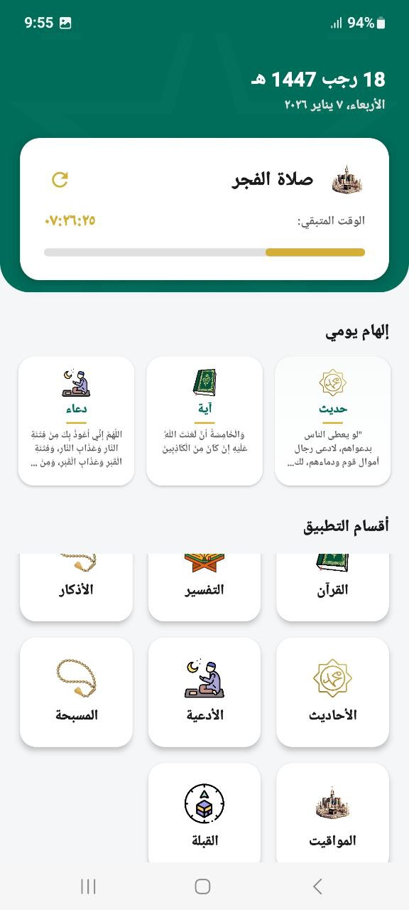 | 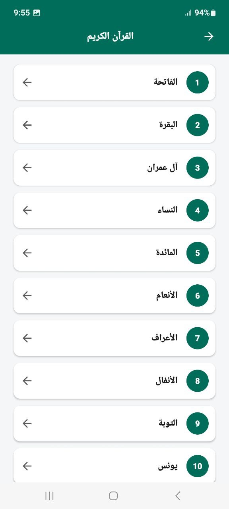 | 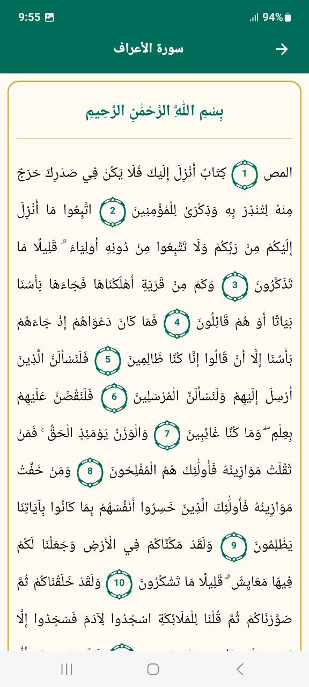 | 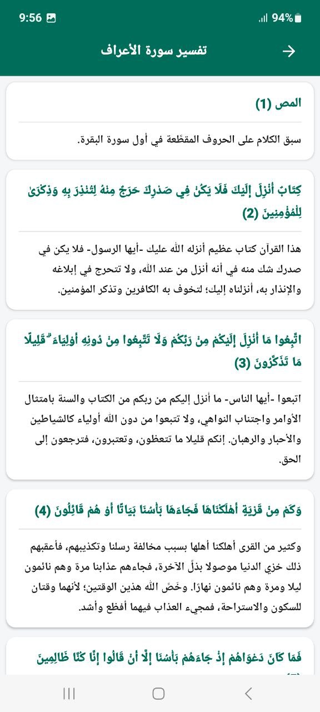 |
| 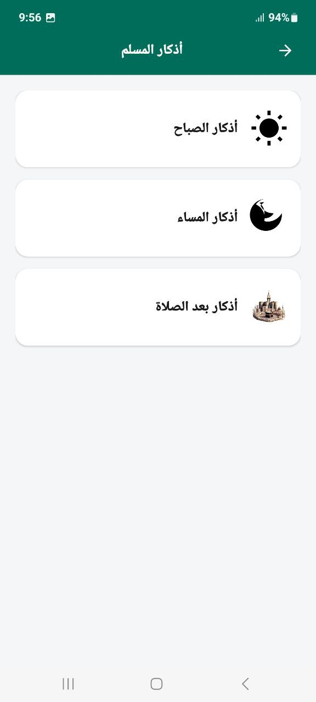 | 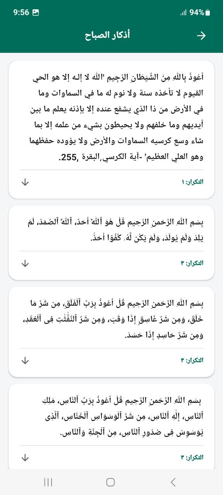 | 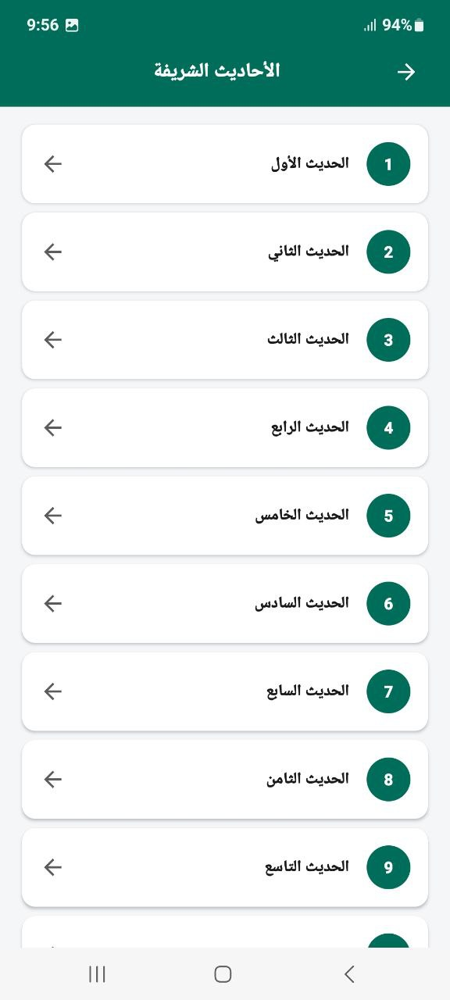 | 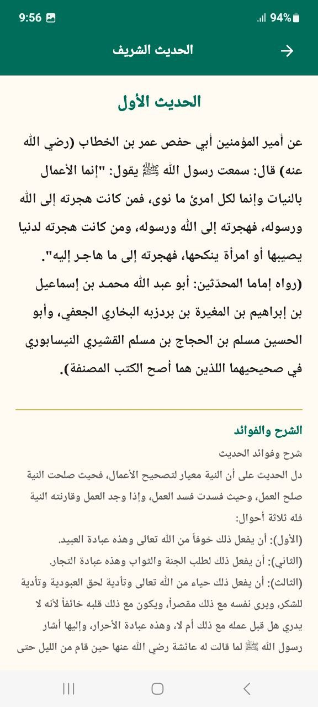 | 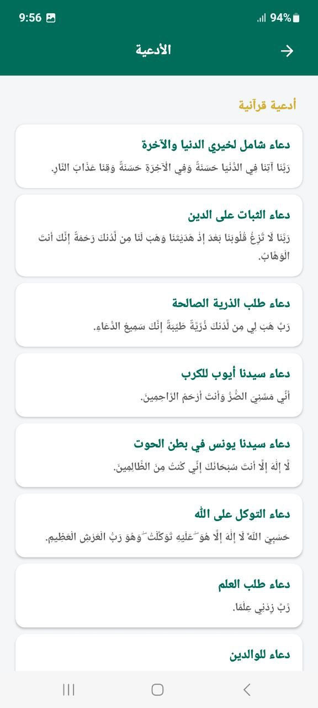 |
| 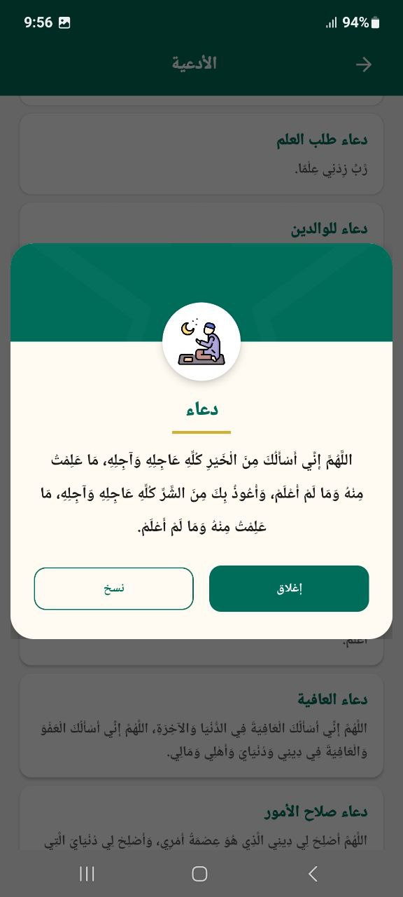 | 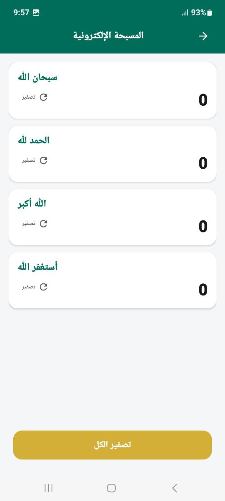 | 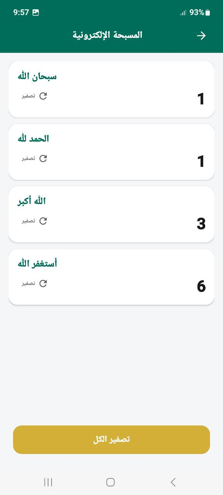 | 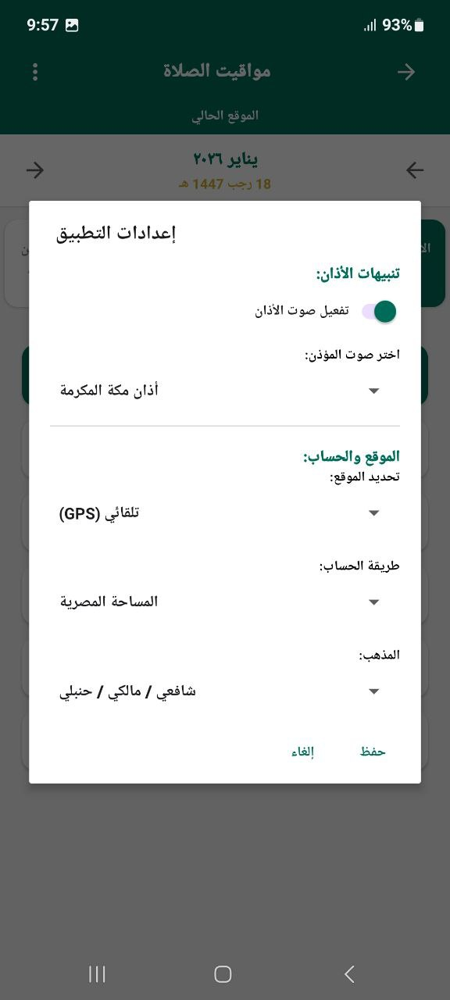 | 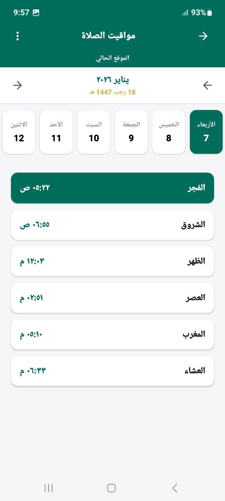 |
| 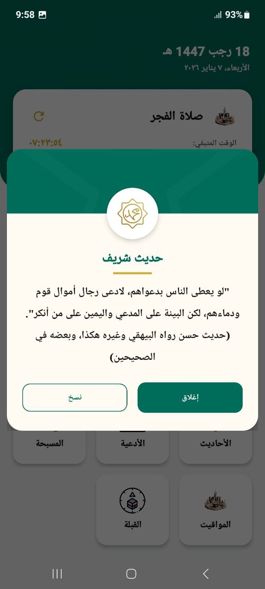 | 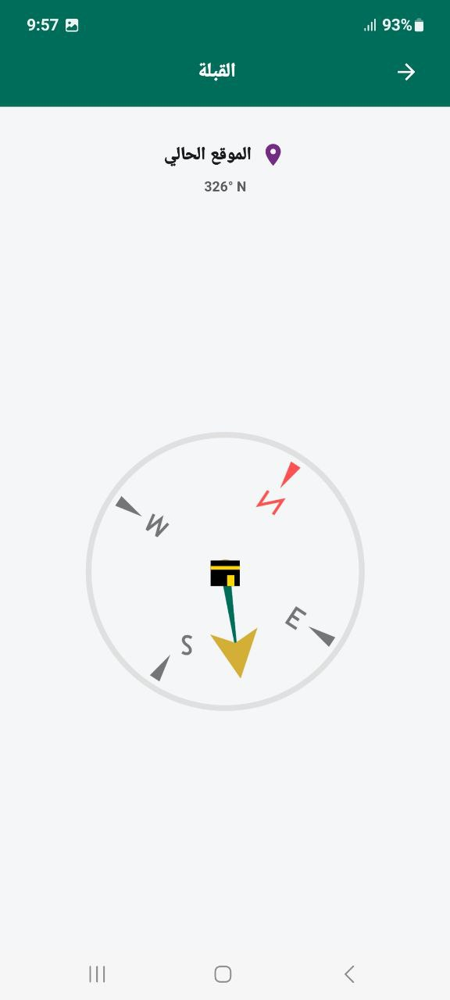 | | | |

---

## ⚙️ Configuration

The app allows users to customize:
* **Location Method:** Automatic (GPS) or Manual (State/City selection).
* **Calculation Method:** Choose from various global standards.
* **Madhab:** Standard or Hanafi.
* **Adhan Voice:** Select preferred Muezzin.
---
**Developed with ❤️ by [Eslam]**
